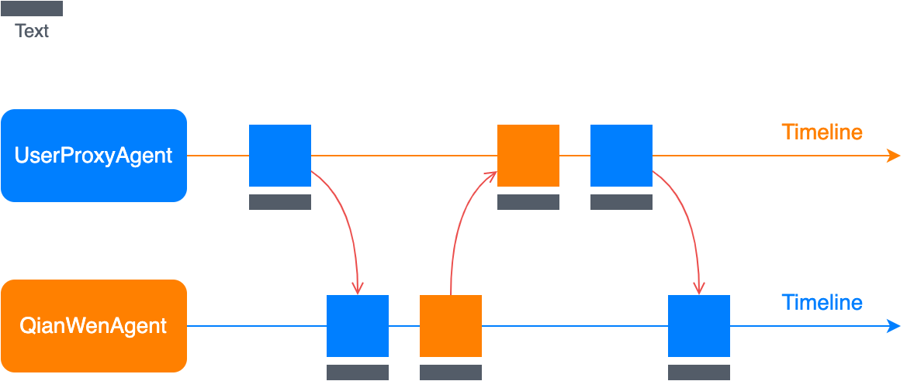
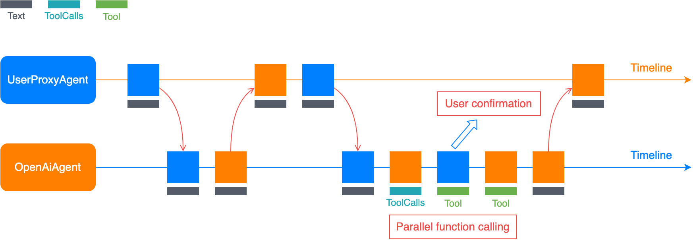
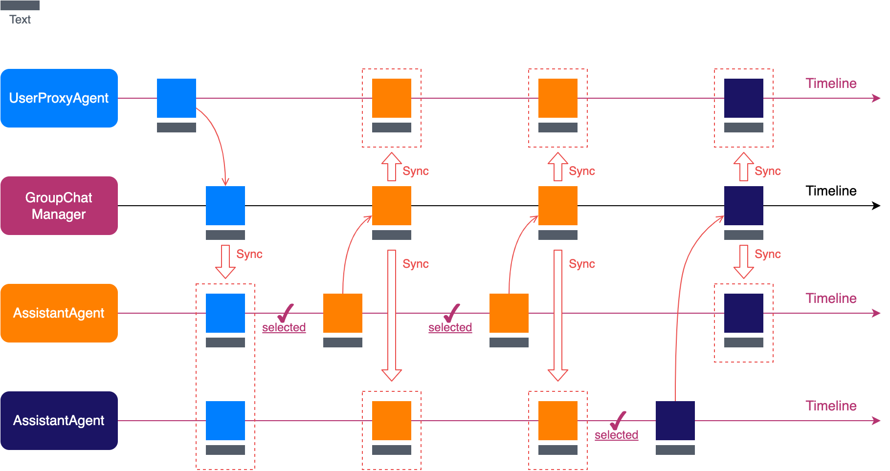

# autogen4j

AI Agent 是一种具备主动思考和行动能力的智能体，它可以在系统中扮演不同的角色，处理各种任务环节。

AI Agent 可以分为 Single-Agent 和 Multi-Agent 两种形式。Single-Agent 是指整个系统中只设计了一个智能体，这个智能体负责处理工作流中的每个环节。而 Multi-Agent 则是系统中设计了多个智能体，每个智能体负责不同的任务环节。在 Multi-Agent 中，通过智能体之间的对话来解决复杂问题。

## 快速开始
如果项目中已经有了`com.alibaba.fastjson2:fastjson2`和`com.squareup.okhttp3:okhttp`，则只需要添加以下依赖。

```xml
<dependency>
  <groupId>cn.homj.autogen4j</groupId>
  <artifactId>autogen4j-agent</artifactId>
  <version>1.0.0</version>
</dependency>
```

注意：`autogen4j-agent`二方包并不会在你的项目中传递任何依赖。如果你的项目中没有 SLF4J 的依赖，则会使用标准输出（Standard Output）。

## Single-Agent
### 和通义千问对话
虽然通义千问在 Github 上演示了函数调用的能力：[function_call_examples.py](https://github.com/QwenLM/Qwen/blob/main/examples/function_call_examples.py)，但[灵积模型服务](https://dashscope.aliyun.com/)中的 API 还没有开放，以下仅演示对话的能力。

```java
public static void main(String[] args) {
    UserProxyAgent user = new UserProxyAgent("Hom J.");
    QianWenAgent assistant = new QianWenAgent("Jarvis")
        .client(new Client())
        .model("qwen-plus")
        .apiKey("your API-KEY");

    user.initChat(assistant, "你好");
    System.exit(0);
}
```

UserProxyAgent 是面向终端用户的代理 Agent，QianWenAgent 是基于通义千问实现的 Agent。先后在终端输入“如何做西红柿炒鸡蛋？”和“可以不放糖吗”，可以看到 Jarvis 的输出，输入`exit`后退出对话。

```shell
[2023-12-15 17:30:11.613] INFO : user(Hom J.): 你好
[2023-12-15 17:30:13.651] INFO : assistant(Jarvis): 你好！很高兴为你提供帮助。
[2023-12-15 17:30:13.652] INFO : Hom J., please continue typing your input.
如何做西红柿炒鸡蛋？
[2023-12-15 17:30:21.915] INFO : user(Hom J.): 如何做西红柿炒鸡蛋？
[2023-12-15 17:30:26.673] INFO : assistant(Jarvis): 材料：
西红柿，鸡蛋，葱花，盐，糖

做法:

1. 西红柿、鸡蛋洗净备用。
2. 将鸡蛋打入碗中，加盐搅拌均匀。
3. 西红柿切成块。
4. 锅中放油炒鸡蛋，鸡蛋变黄出锅。
5. 锅中放油炒葱花，放入西红柿。
6. 放入糖、盐，最后倒入炒好的鸡蛋即可。
[2023-12-15 17:30:26.673] INFO : Hom J., please continue typing your input.
可以不放糖吗
[2023-12-15 17:30:30.700] INFO : user(Hom J.): 可以不放糖吗
[2023-12-15 17:30:32.256] INFO : assistant(Jarvis): 可以的，糖的作用是可以中和西红柿的酸味，如果你不喜欢甜味，不放也是可以的。
[2023-12-15 17:30:32.256] INFO : Hom J., please continue typing your input.
exit

Process finished with exit code 0
```

代码示例：[QianWenAgentTest.java](src/test/java/cn/homj/autogen4j/QianWenAgentTest.java)



### 和OpenAI的GPT对话
OpenAI 的文本生成模型支持函数调用（Function calling），其中`gpt-3.5-turbo-1106`模型还提供并行函数调用的能力（Parallel function calling）。

> We strongly recommend building in user confirmation flows before taking actions that impact the world on behalf of users (sending an email, posting something online, making a purchase, etc).

以上 OpenAI 文档中关于 Function calling 中的一段话，大意是执行函数调用前应该要有用户的确认流程。`autogen4j-agent`可以在工具包（Toolkit）中定义工具的使用权限，这部分也是与微软 AutoGen 最大的不同点。

```java
public static void main(String[] args) {
    UserProxyAgent user = new UserProxyAgent("Hom J.");
    OpenAiAgent assistant = new OpenAiAgent("Jarvis");

    AgentToolkit toolkit = new AgentToolkit()
        .add(bookRestaurant().permit(user))
        .add(getCurrentWeather().permitAll(true));
    toolkit.register(user, assistant);

    assistant
        .client(new Client())
        .model("gpt-3.5-turbo-1106")
        .apiKey("your API-KEY")
        .addFunction(BOOK_RESTAURANT)
        .addFunction(GET_CURRENT_WEATHER)
        .unconfirmedMessage("还有其他我可以帮您的吗？");

    user.initChat(assistant, "你好");
    System.exit(0);
}
```

目前 OpenAI 允许的工具仅支持函数类型，以上代码定义的 toolkit 添加了两个函数：订餐（bookRestaurant）和查询天气（getCurrentWeather）。其中订餐仅允许 user 执行，查询天气允许所有的 Agent 执行。

当在终端输入“杭州和苏州的天气怎么样”，可以看到一次返回了两个函数调用。执行订餐前需要用户输入`y`表示同意，`N`表示拒绝。

```shell
[2023-12-15 17:34:09.809] INFO : user(Hom J.): 你好
[2023-12-15 17:34:16.531] INFO : assistant(Jarvis): 你好，有什么可以帮助你的吗？
[2023-12-15 17:34:16.532] INFO : Hom J., please continue typing your input.
杭州和苏州的天气怎么样
[2023-12-15 17:35:17.531] INFO : user(Hom J.): 杭州和苏州的天气怎么样
[2023-12-15 17:35:23.339] INFO : +-----------------------------------------
[2023-12-15 17:35:23.339] INFO : function: get_current_weather, arguments:
{"location": "Hangzhou", "unit": "celsius"}
[2023-12-15 17:35:23.339] INFO : +-----------------------------------------
[2023-12-15 17:35:23.340] INFO : function execution result: {"location":"Hangzhou","unit":"celsius","temperature":"25.7","description":"sunny"}
[2023-12-15 17:35:23.340] INFO : +-----------------------------------------
[2023-12-15 17:35:23.340] INFO : function: get_current_weather, arguments:
{"location": "Suzhou", "unit": "celsius"}
[2023-12-15 17:35:23.340] INFO : +-----------------------------------------
[2023-12-15 17:35:23.340] INFO : function execution result: {"location":"Suzhou","unit":"celsius","temperature":"25.7","description":"sunny"}
[2023-12-15 17:35:26.301] INFO : assistant(Jarvis): 杭州和苏州都是晴天，当前温度分别为 25.7°C。有其他需要了解的天气情况吗？
[2023-12-15 17:35:26.301] INFO : Hom J., please continue typing your input.

帮我订个晚餐
[2023-12-15 17:35:37.978] INFO : user(Hom J.): 帮我订个晚餐
[2023-12-15 17:35:42.172] INFO : assistant(Jarvis): 当然，请问你想预订哪家餐厅？还有就餐时间和用餐人数是多少呢？
[2023-12-15 17:35:42.172] INFO : Hom J., please continue typing your input.
楼外楼 3个人 2023/12/20
[2023-12-15 17:36:04.098] INFO : user(Hom J.): 楼外楼 3个人 2023/12/20
[2023-12-15 17:36:07.497] INFO : +-----------------------------------------
[2023-12-15 17:36:07.498] INFO : function: book_restaurant, arguments:
{"name":"楼外楼","dining_time":"2023-12-20 18:30","number_of_diners":3}
[2023-12-15 17:36:07.498] INFO : +-----------------------------------------
[2023-12-15 17:36:07.498] INFO : please type 'y' to agree or 'N' to refuse.
N
[2023-12-15 17:36:11.535] INFO : [Hom J.] refuses to execute.
[2023-12-15 17:36:11.535] INFO : assistant(Jarvis): 还有其他我可以帮您的吗？
[2023-12-15 17:36:11.535] INFO : Hom J., please continue typing your input.

提前半个小时
[2023-12-15 17:36:20.793] INFO : user(Hom J.): 提前半个小时
[2023-12-15 17:36:25.046] INFO : +-----------------------------------------
[2023-12-15 17:36:25.046] INFO : function: book_restaurant, arguments:
{"name":"楼外楼","dining_time":"2023-12-20 18:00","number_of_diners":3}
[2023-12-15 17:36:25.046] INFO : +-----------------------------------------
[2023-12-15 17:36:25.046] INFO : please type 'y' to agree or 'N' to refuse.
y
[2023-12-15 17:36:29.498] INFO : function execution result: success
[2023-12-15 17:36:33.987] INFO : assistant(Jarvis): 好的，餐厅预订已经成功确认，您和您的伙伴可以在 2023 年 12 月 20 日 18:00 前往楼外楼享用晚餐。祝您用餐愉快！如果还有其他需要帮助的，请随时告诉我。
[2023-12-15 17:36:33.987] INFO : Hom J., please continue typing your input.
exit

Process finished with exit code 0
```

代码示例：[OpenAiAgentTest2.java](src/test/java/cn/homj/autogen4j/OpenAiAgentTest2.java)



## Multi-Agent
多个 Agent 在群聊（GroupChat）中对话，由管理员（GroupChatManager）选择下一个发言的 Agent。

```java
public static void main(String[] args) {
    Client client = new Client();

    UserProxyAgent user = new UserProxyAgent("Hom J.");
    QianWenAgent taylor = new QianWenAgent("Taylor");
    QianWenAgent jarvis = new QianWenAgent("Jarvis");

    GroupChat groupChat = new GroupChat()
        .addAgent(user, "正在寻求帮助的用户")
        .addAgent(taylor, "温柔的知心姐姐，当你遇到问题时，总是会给予鼓励和支持。")
        .addAgent(jarvis, "旅游达人，可以提供目的地建议、行程规划。");
    GroupChatManager manager = taylor.newManager("manager").groupChat(groupChat);

    taylor
        .client(client)
        .model("qwen-plus")
        .apiKey("your API-KEY")
        .temperature(0.01F)
        .systemMessage("你是我的知心姐姐，无论我遇到什么问题，你会耐心倾听并给予鼓励和支持。");

    jarvis
        .client(client)
        .model("qwen-plus")
        .apiKey("your API-KEY")
        .temperature(0.01F)
        .systemMessage("你是一名旅游达人，可以提供目的地建议、行程规划。");

    user.initChat(manager, "你好");
    System.exit(0);
}
```

用户、泰勒（Taylor）和贾维斯（Jarvis）在一个群聊里，管理员（GroupChatManager）与 Taylor 使用相同的配置，同样支持在群聊中使用 OpenAiAgent。

```shell
[2023-12-16 10:32:44.011] INFO : user(Hom J.): 你好
[2023-12-16 10:32:46.800] INFO : assistant(Taylor): 你好，Hom J.！很高兴能为你提供帮助。有什么可以帮到你的吗？
[2023-12-16 10:32:47.341] INFO : Hom J., please continue typing your input.
周末要加班不开心
[2023-12-16 10:33:00.188] INFO : user(Hom J.): 周末要加班不开心
[2023-12-16 10:33:04.304] INFO : assistant(Taylor): 我理解你的感受，Hom J.。工作和休息的平衡很重要。不过，也许你可以试着从中找到一些积极的一面，比如可以提前完成任务或者获得额外的收入。同时，也要记得在平时多照顾好自己，保持良好的生活习惯和心态。如果你需要的话，我可以陪你聊聊天，帮你缓解一下压力。
[2023-12-16 10:33:04.903] INFO : Hom J., please continue typing your input.

想去上海玩，帮我安排一日游
[2023-12-16 10:33:18.842] INFO : user(Hom J.): 想去上海玩，帮我安排一日游
[2023-12-16 10:33:27.182] INFO : assistant(Jarvis): 当然可以，Hom J.！以下是我为你规划的上海一日游行程：

  1. 上午：首先可以去外滩欣赏上海的标志性建筑和黄浦江美景。然后步行到南京路步行街购物、品尝美食。
  2. 中午：在南京路附近找一家地道的上海菜馆享用午餐。
  3. 下午：前往豫园游览古典园林，并在附近的城隍庙品尝小吃。之后可以乘坐观光巴士或地铁前往田子坊体验上海的艺术氛围。
  4. 晚上：可以选择在浦东新区的陆家嘴地区欣赏夜景，如东方明珠电视塔、金茂大厦等。

希望这个行程能帮到你，如果你有其他需求或者问题，欢迎随时告诉我。
[2023-12-16 10:33:30.023] INFO : assistant(Jarvis): 如果你对这个行程感兴趣，我可以为你提供更详细的景点介绍和交通指南。另外，上海的天气变化较大，记得提前查看天气预报并做好防晒措施哦。
[2023-12-16 10:33:30.679] INFO : Hom J., please continue typing your input.
exit

Process finished with exit code 0
```

代码示例：[GroupChatManagerTest3.java](src/test/java/cn/homj/autogen4j/GroupChatManagerTest3.java)

